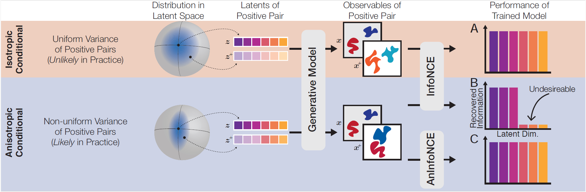

# Contrastive Learning: Reducing the Gap Between Theory and Practice

This repository contains code and training logs the paper [Contrastive Learning: Reducing the Gap Between Theory and Practice](https://arxiv.org/abs/2407.00143) by Evgenia Rusak*, Patrik Reizinger*, Attila Juhos*, Oliver Bringmann, Roland S. Zimmermann° & Wieland Brendel°.

**Abstract**: Previous theoretical work on contrastive learning (CL) with InfoNCE showed that, under certain assumptions, the learned representations uncover the ground-truth latent factors. We argue that these theories overlook crucial aspects of how CL is deployed in practice. Specifically, they assume that within a positive pair, all latent factors either vary to a similar extent, or that some do not vary at all. However, in practice, positive pairs are often generated using augmentations such as strong cropping to just a few pixels. Hence, a more realistic assumption is that all latent factors change, but there exists a continuum of variability across these factors. We introduce AnInfoNCE, a generalization of InfoNCE that can provably uncover the latent factors in this anisotropic setting, thereby broadly generalizing previous identifiability results in CL. We validate our identifiability results in controlled experiments and show that AnInfoNCE increases the recovery of previously collapsed information in CIFAR and ImageNet. Additionally, we explore and discuss further mismatches between theoretical assumptions and practical implementations, including extensions to hard negative mining and loss ensembles.



## Experiments

1) To model a data generating process (DGP) with an anisotropic conditional where half of the diagonal ground-truth $\Lambda$ takes one value and the other half a different value, run:

```
python main_mlp.py --n 10 --batch-size 1000 --space extended_sphere --c-p 0 --p 0 --only-unsupervised --gt-lambda-1 5 --gt-lambda-2 25
```

Results for this setting can be found in training_logs/logs_for_bimodal_lambda.log

2) To model a data generating process (DGP) where all latent dimensions vary to a different extent, we can linearly space the ground truth $\Lambda$ between a $\Lambda_{min}$ and a $\Lambda_{max}$. To reproduce results for this setting, run 

```
python main_mlp.py --n 10 --batch-size 1000 --space extended_sphere --c-p 0 --p 0 --only-unsupervised --gt-lambda-1 5 --gt-lambda-2 25 --linearly-spaced-lambda
```

Results for this setting can be found in training_logs/logs_for_linearly_spaced_lambda.log
